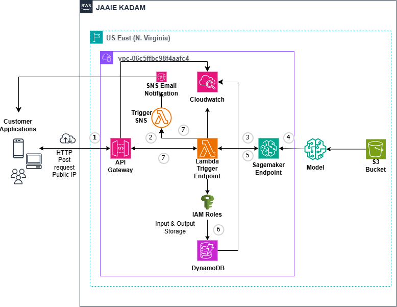

# 📈 Stock Price Prediction – End-to-End AWS Machine Learning System

A production-style machine learning pipeline that forecasts next-day stock closing prices using XGBoost and serves real-time predictions through a fully serverless AWS architecture.  
This project demonstrates practical ML engineering, cloud deployment, observability, and distributed system design using AWS Lambda, API Gateway, SageMaker, S3, DynamoDB, SNS, and CloudWatch.

---

## 🚀 Key Features

- **Predictive ML Model**
  - Trains an XGBoost regression model using engineered time-series features (returns, moving averages, volatility).

- **Serverless Real-Time Inference**
  - AWS Lambda exposes a `/predict` endpoint for fast, low-cost real-time predictions.

- **AWS-Hosted Model Serving**
  - Supports two inference modes:
    - Via an **Amazon SageMaker XGBoost endpoint**
    - Via a **locally loaded serialized model** packaged with Lambda

- **Data Logging & Monitoring**
  - Prediction inputs/outputs can be logged into **DynamoDB**
  - Operational visibility enabled through **CloudWatch Logs** & metrics

- **Automated Notifications**
  - **SNS email alerts** for prediction results or pipeline events

- **Modern, Reproducible Project Structure**
  - Clear separation of training code, inference code, documentation, and experiments

---

## 🧱 Architecture Overview

### 🔹 ML Training Workflow
1. Load historical stock price data from CSV.  
2. Engineer predictive features:
   - Daily return
   - Moving averages (MA5, MA10)
   - Rolling volatility  
3. Train an **XGBoost regression model** to predict next-day closing price.  
4. Save trained model locally in `models/xgb_stock_model.pkl`.

### 🔹 Cloud Deployment Workflow
1. **API Gateway** exposes a REST `/predict` endpoint.  
2. A **Lambda function** processes input, loads the model (local or SageMaker), and returns predictions.  
3. **DynamoDB** stores prediction history (optional).  
4. **SNS** triggers email notifications for each prediction (optional).  
5. **CloudWatch** logs function execution and helps with monitoring & debugging.

---

## 🗺 Architecture Diagram

